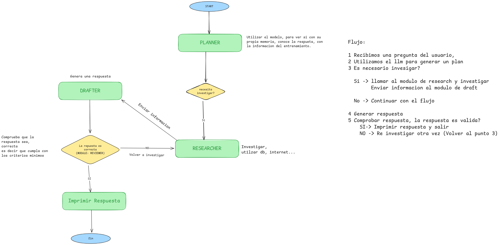

# Ejercicio práctico: Agente investigador con LangGraph y tools

## Objetivo del ejercicio
Construir un **agente con estado y control de flujo** usando **LangGraph** y la **API de OpenAI**, capaz de:

1. Decidir si necesita investigar
2. Usar una **tool de búsqueda**
3. Redactar una respuesta
4. **Verificar su propia respuesta**
5. Repetir el proceso si la respuesta no es válida

Este ejercicio demuestra **cuándo LangGraph es necesario** frente a chains lineales.

## Requisitos
pip install -r requirements.txt

**Configurar variable de entorno en un archivo .env**
OPENAI_API_KEY = "TU_API_KEY"

## Contexto del problema
Un usuario hace una pregunta factual (ej. “¿Qué es LangGraph?”).

El sistema **NO debe responder directamente** si no está seguro.

Debe:

- investigar
- justificar su respuesta
- validarla antes de finalizar

## Arquitectura (conceptual)

- **Planner**: decide si hace falta investigar
- **Research**: usa tools
- **Draft**: redacta
- **Review**: valida y decide si repetir

## Criterios de evaluación

El ejercicio está bien resuelto si:

- El flujo **NO es lineal**
- Se usan tools correctamente
- El estado se actualiza en cada nodo
- El agente puede repetir ciclos
- El sistema termina de forma controlada