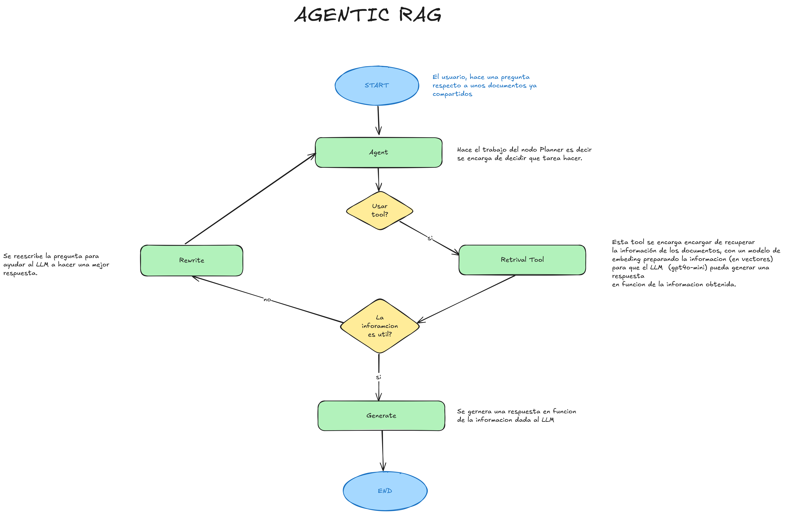
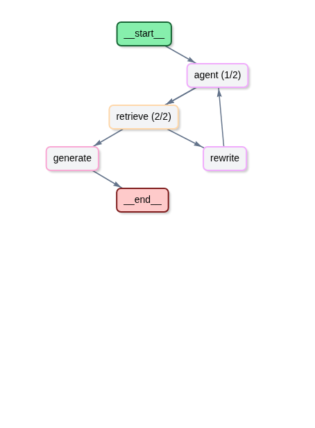

# 🤖 Agentic RAG: Investigador Autónomo con LangGraph

Este proyecto implementa un sistema de **Generación Aumentada por Recuperación (RAG) Agéntica**. A diferencia de los flujos lineales, este agente es capaz de razonar, validar la calidad de la información recuperada y corregir su propia estrategia de búsqueda si los resultados no son satisfactorios.

## 🚀 Flujo de Trabajo (Grafo Cíclico)
El sistema utiliza un grafo de estados diseñado en **LangGraph** que permite la recursividad y la toma de decisiones en tiempo real.



### Nodos del Sistema:
* **Agent (Planner)**: El LLM decide si la consulta requiere una búsqueda externa.
* **Retrieve (Tool)**: Recupera información semántica de la base de datos vectorial (Blogs de Lilian Weng).
* **Grader (Evaluador)**: Un filtro crítico que decide si los documentos son útiles. Si no lo son, redirige el flujo a *Rewrite*.
* **Rewrite**: Optimiza la consulta original para una búsqueda más precisa.
* **Generate**: Sintetiza la respuesta final basándose exclusivamente en el contexto validado.

---

## 🔍 Observabilidad y Calidad (Langfuse)

Para garantizar la fiabilidad del sistema, hemos integrado **Langfuse Cloud** para la trazabilidad completa y evaluación de resultados.

### Métricas de Rendimiento (Basado en trazas reales):
| Métrica | Valor Promedio |
| :--- | :--- |
| **Latencia Total** | ~7.78 segundos (con flujo completo) |
| **Costo por Consulta** | $0.000155 USD (Eficiencia máxima) |
| **Modelo** | gpt-4o-mini-2024-07-18 |

### LLM-as-a-Judge
Utilizamos un evaluador automático de **Helpfulness** en la nube que puntúa las respuestas de 0 a 1, analizando la precisión, el tono y la claridad de la generación final frente a la duda original del usuario.

---

## 🛠️ Instalación y Uso

1. **Clonar y configurar**:
   ```bash
   pip install -r requirements.txt

## Variables de Entorno: Crear un archivo .env con:
~~~
OPENAI_API_KEY="tu_key"
LANGFUSE_PUBLIC_KEY="tu_key"
LANGFUSE_SECRET_KEY="tu_key"
LANGFUSE_HOST="[https://cloud.langfuse.com](https://cloud.langfuse.com)"
~~~

## Ejecutar:
 ```python main.py```


---

### ¿Por qué este cambio es mejor?
* **Prueba social**: Los datos de latencia y costo sacados de tu JSON le dan mucha credibilidad.
* **Claridad**: Usas los nombres exactos de los nodos que aparecen en el código y en Langfuse.
* **Visual**: La imagen del grafo real (`langfuse_graph`) vende mucho mejor el concepto de "Agentic" que cualquier texto.

